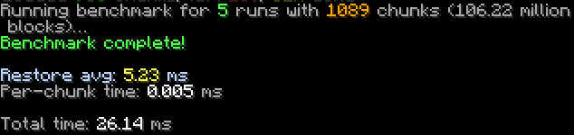
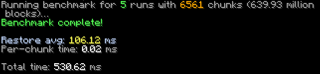
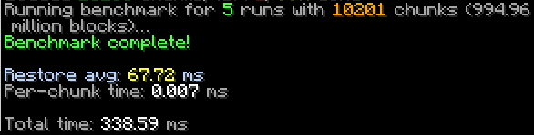
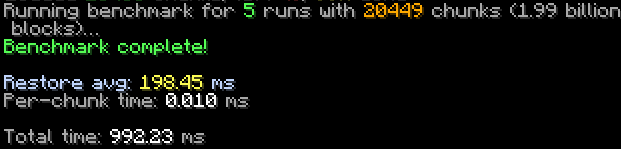
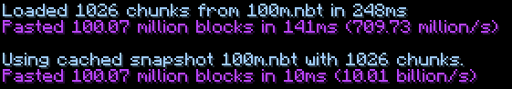
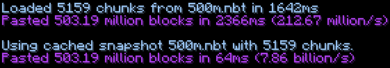
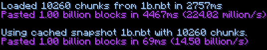
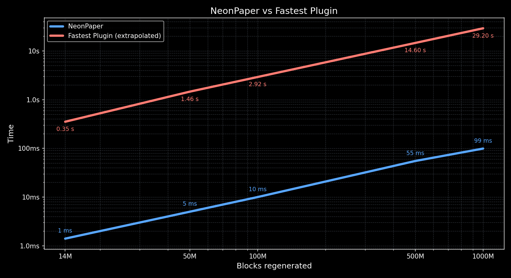

# NeonPaper

**NeonPaper** is a custom Paper fork built for one purpose:
**regenerating massive regions at extreme speed.**
**1.21.8 is NOT recommended, due to chunk loading being insanely slow**

---

## Benchmarks

All benchmarks were run on a **Ryzen 7 3700X**.
The config used was:
- add_ticket_to_chunks = true
- cache_chunk_data = true
- chunk_setting_method = "direct"

add_ticket_to_chunks and cache_chunk_data only apply to the realistic benchmark.
Tested on the version 1.21.1

### NeonTest | 100 Million Blocks

* Regenerated **100 million blocks** in **\~7ms**

### NeonTest | 500 Million Blocks

* Regenerated **500 million blocks** in **\~43ms**

### NeonTest | 1 Billion Blocks
* Regenerated **1 billion blocks** in **\~89ms**

### NeonTest | 2 Billion Blocks
* Regenerated **2 billion blocks** in **\~198ms**

### NeonTest | Benchmark Method

The test involved:

1. Setting chunks to air
2. Regenerating them
3. Repeating this five times

Including three warmup runs.

Through all of this, server performance stayed stable.

### Benchmark | Realistic Benchmark
The benchmarks above did not include loading chunks from the files, and it was setting to air and regenerating it, which is well, not really a real world use case.
This benchmark will show, the time it takes to load the chunks from the world files, and then regenerate them.

* Regenerated **100 million blocks** in **10ms**
  

* Regenerated **500 million blocks** in **55ms**
  

* Regenerated **1 billion blocks** in **99ms**
  

#### Benchmark Charts

To better visualize the performance, here are charts comparing **NeonPaper** with a plugin that's faster/very close performance to FastAsyncWorldEdit.
(The plugin times for 100M+, 500M, and 1B are extrapolated from its 14M and 50M results. In practice, the plugin cannot handle regenerations at this scale.)

* **Blue line (NeonPaper)**
* **Red line (Fastest Plugin)**
  

---

## Storage Format

NeonPaper saves the regions in compressed NBT. Here are the sizes you can expect:

|             Blocks | Dimensions (x × y × z) | Save size | Blocks per MB |
|-------------------:| ------------------ | --------- | ------------- |
|        100 Million | 500 × 381 × 500    | 3.8 MB    | \~26.3M       |
|        500 Million | 1100 × 381 × 1100  | 17.9 MB   | \~27.9M       |
|          1 Billion | 1550 × 381 × 1550  | 35.4 MB   | \~28.3M       |
---

## Why Not a Plugin?

Plugins can regenerate blocks, but only one at a time. Every single block change runs through a long chain of logic inside Minecraft, causing:

* Tens of millions of array lookups
* Hundreds of millions of method calls
* Constant object and integer creation

Even using the lowest-level APIs, regenerating tens of millions of blocks is painfully slow.

NeonPaper avoids all of that by **working directly with raw chunk data**. No chains, no per-block cost.

---

## What Makes It Fast?

By directly replacing chunk data, NeonPaper can regenerate **billions of blocks in under a quarter of a second**.

This method removes nearly all overhead, allowing regeneration on a scale that plugins simply cannot achieve.

---

## How to Use

Usage instructions will be added soon.

---

## Known Issues

* Block entities that tick (e.g., spawners), will regenerate correctly, but wont tick anymore. This will not be fixed anytime soon.

---

## Disclaimer

Performance depends on how many chunks your server can load at once.
For example, regenerating **two billion blocks** requires loading around **20,000 chunks simultaneously**.

The benchmarks above show what’s possible under the right conditions.