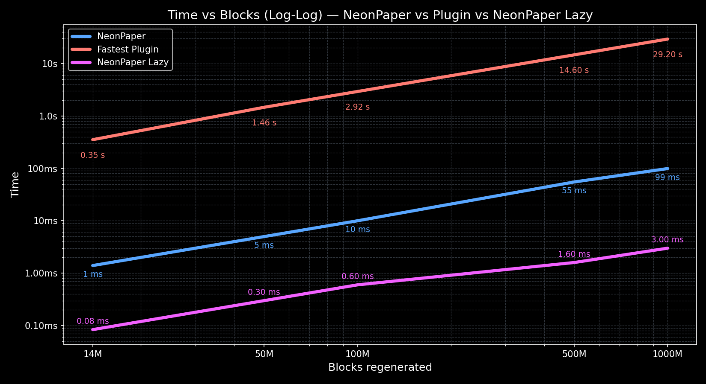

# NeonPaper

**NeonPaper** is a custom Paper fork built for one purpose:
**regenerating massive regions at extreme speed.**

## Benchmark Charts

To better visualize the performance, here are charts comparing **NeonPaper** and **NeonPaper Lazy** with a plugin that's faster/very close performance to FastAsyncWorldEdit.
(The plugin times for 100M+, 500M, and 1B are extrapolated from its 14M and 50M results. In practice, the plugin cannot handle regenerations at this scale.)

* **Blue line (NeonPaper)**
* **Magenta line (NeonPaper Lazy)**
* **Red line (Fastest Plugin)**
  

---

## Storage Format

NeonPaper saves the regions in compressed NBT. Here are the sizes you can expect:

|             Blocks | Dimensions (x × y × z) | Save size | Blocks per MB |
|-------------------:| ------------------ | --------- | ------------- |
|        100 Million | 500 × 381 × 500    | 6.9 MB    | \~14.5M       |
|        500 Million | 1100 × 381 × 1100  | 37.9 MB   | \~13.2M       |
|          1 Billion | 1550 × 381 × 1550  | 67.2 MB   | \~14.9M       |
---

## Why Not a Plugin?

Plugins can regenerate blocks, but only one at a time. Every single block change runs through a long chain of logic inside Minecraft, causing:

* Tens of millions of array lookups
* Hundreds of millions of method calls
* Constant object and integer creation

Even using the lowest-level APIs, regenerating tens of millions of blocks is painfully slow.

NeonPaper avoids all of that by **working directly with raw chunk data**. No chains, no per-block cost.

---

## What Makes It Fast?

By directly replacing chunk data, NeonPaper can regenerate **billions of blocks in under a quarter of a second**.

This method removes nearly all overhead, allowing regeneration on a scale that plugins simply cannot achieve.

---

## Documentation

- [Usage](usage/USAGE.md) – Commands and configuration details
- [Benchmarks](benchmarks/BENCHMARK.md) – Performance tests and comparisons

---

## Known Issues

* Block entities that tick (e.g., spawners), will regenerate correctly, but wont tick anymore. This will not be fixed anytime soon.

---

## ~~Disclaimer~~ Regeneration Modes (1.21.4)

~~Performance depends on how many chunks your server can load at once.~~
~~For example, regenerating **two billion blocks** requires loading around **20,000 chunks simultaneously**.~~

~~The benchmarks above show what’s possible under the right conditions.~~

**As of 1.21.4**, NeonPaper introduces regeneration modes, which changes how the regeneration system processes chunks:

- **immediate**  
  Chunks are loaded and regenerated immediately when triggered. The initial regeneration may take a long time if chunks are not already loaded. Recommended for small/medium regions.

- **lazy**  
  A map of chunks to regenerate is created. Chunks are regenerated automatically when accessed, meaning you can regenerate **effectively unlimited chunks** without loading all of them at once. Minor overhead exists, and the map is saved on server stop. Stopping during pending lazy regeneration will slow down the stopping time, and force stopping will lead to corruption!

- **lazy_background**  
  Works like lazy, but flushes the chunk map to disk every N seconds (default 60) to reduce corruption chances. Immediate shutdown can still cause corruption unless `save_at_stop_lazy_background` is enabled.

Choosing `lazy` or `lazy_background` allows regeneration of **huge regions** (20k+ chunks) without causing lag, unlike `immediate`, which requires loading all chunks simultaneously.

For example, regenerating **two billion blocks** with `immediate` would require around **20,000 chunks loaded at once**, but with `lazy`, the chunks are regenerated on access, avoiding that load and regenerate spike.