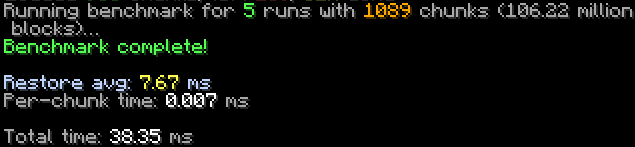
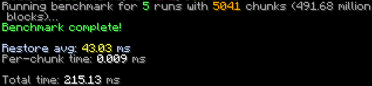
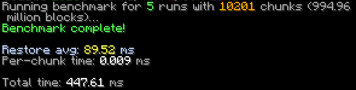

# Benchmarks

All benchmarks were run on a **Ryzen 7 3700X**.
The config used was:
- add_ticket_to_chunks = true
- cache_chunk_data = true
- chunk_setting_method = "direct"
- regen_mode = "immediate"

add_ticket_to_chunks and cache_chunk_data only apply to the realistic benchmark.
Tested on the version 1.21.1 (1.21.4 and 1.21.8 have similar performance)

## NeonTest | 100 Million Blocks

* Regenerated **100 million blocks** in **\~7ms**

## NeonTest | 500 Million Blocks

* Regenerated **500 million blocks** in **\~43ms**

## NeonTest | 1 Billion Blocks
* Regenerated **1 billion blocks** in **\~89ms**

## NeonTest | 2 Billion Blocks
* Regenerated **2 billion blocks** in **\~198ms**

## NeonTest | Benchmark Method

The test involved:

1. Setting chunks to air
2. Regenerating them
3. Repeating this five times

Including three warmup runs.

Through all of this, server performance stayed stable.

## Benchmark | Realistic Benchmark
The benchmarks above did not include loading chunks from the files, and it was setting to air and regenerating it, which is well, not really a real world use case.
This benchmark will show, the time it takes to load the chunks from the world files, and then regenerate them.

* Regenerated **100 million blocks** in **10ms**
  

* Regenerated **500 million blocks** in **55ms**
  

* Regenerated **1 billion blocks** in **99ms**
  